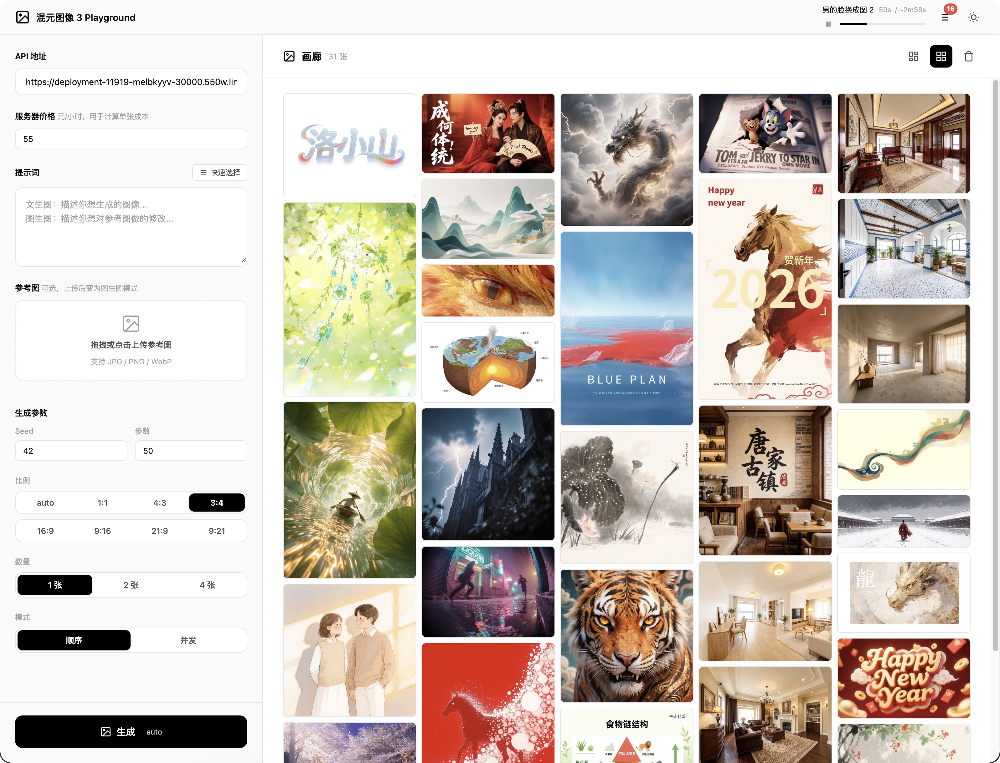
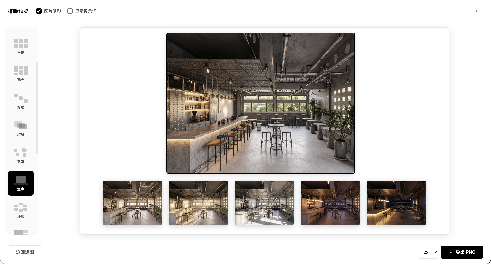

# HunyuanImage 3 Playground

本地 Web 测试页面，用于测试腾讯混元图像 3.0 API 服务。让 AI 图像生成变得简单高效！

**Powered by Tencent Hunyuan**

## 🔗 混元图像 3.0 相关链接

- [官方网站](https://hunyuan.tencent.com/image/zh)
- [HuggingFace](https://huggingface.co/tencent/HunyuanImage-3.0-Instruct)
- [技术论文](https://arxiv.org/abs/2509.23951)
- [官方 GitHub](https://github.com/Tencent-Hunyuan/HunyuanImage-3.0)

## 📸 界面预览

### 系统界面

<div align="center">
  
</div>

### 图片画廊

<div align="center">
  
</div>

## 🌟 核心优势

- **简洁美观**：现代化界面设计，操作直观流畅
- **实时反馈**：生成进度实时显示，体验流畅
- **灵活配置**：支持自定义 API 地址和生成参数
- **开箱即用**：内置示例提示词，快速上手

## 🚀 快速开始

### 1. 部署 API 服务（推荐）

推荐在 [共绩云平台](https://console.suanli.cn/serverless/idc) 开通 **640G 显存以上**的弹性设备，部署完成后即可获得 API 地址。

> 💡 提示：部署完成后会得到类似 `https://deployment-xxxxx.550w.link` 的地址

### 2. 安装依赖

```bash
pip install -r requirements.txt
```

### 3. 启动服务

```bash
python3 app.py
```

服务会自动在 8000-9000 端口范围内随机选择一个可用端口启动。

### 4. 使用方法

1. 在浏览器中打开显示的地址（例如 `http://localhost:8234`）
2. 输入你的 API 地址（例如 `https://deployment-11919-melbkyyv-30000.550w.link`）
3. 输入提示词或选择示例提示词
4. 调整生成参数（可选）
5. 点击「生成图像」按钮

## 💡 核心功能

### 🎨 图像生成

- **灵活配置**：支持自定义比例（1:1、16:9、9:16 等）和分辨率（512-2048px）
- **批量生成**：一次生成多张图片，支持顺序或并发模式
- **参考图片**：支持上传参考图，引导生成风格
- **参数调节**：随机种子、推理步数、图像尺寸等参数可调
- **快速选择**：内置多组示例提示词，快速开始创作

### 📊 任务管理

- **实时队列**：导航栏显示任务状态，点击展开查看详情
- **进度追踪**：实时显示生成进度（排队中/生成中 N/M）
- **失败重试**：连接失败时任务保留，支持手动重试
- **任务操作**：支持置顶、取消、删除等操作

### 🖼️ 图片画廊

- **历史记录**：自动保存所有生成的图片
- **拖拽排序**：鼠标拖动图片卡片自由调整顺序，自动保存
- **图片导入**：点击导入按钮或拖拽外部图片到画廊，支持多选
- **紧凑视图**：切换紧凑模式，一屏展示更多图片
- **图片详情**：点击查看大图、提示词、生成参数
- **批量操作**：支持批量删除、清空画廊
- **画廊模式**：选择多张图片合成排版导出（最多 9 张）

### 🎭 画廊模式（Gallery Mode）

- **多图排版**：选择 1-9 张图片，自动排版合成
- **排版模式**：支持自动、横排、竖排、网格、瀑布流等布局
- **自由编辑**：拖拽移动、调整大小、框选多图
- **高清导出**：支持 1x-4x 分辨率导出 PNG

### 🎯 用户体验

- **深色模式**：支持亮色/深色主题切换
- **响应式设计**：适配各种屏幕尺寸
- **数据持久化**：配置和历史记录自动保存
- **成本计算**：实时显示服务器成本（可选）

## 🔧 生成参数说明

- **随机种子**: 固定种子可以生成相同的图像，-1 为随机
- **图像尺寸**: 预设尺寸或自定义宽高
- **宽度/高度**: 自定义图像尺寸（像素）
- **推理步数**: 步数越多质量越好，但生成时间越长（推荐 50）

## 📁 项目结构

```
hunyuan_image_3_playground/
├── app.py              # FastAPI 服务
├── api_client.py       # API 客户端
├── requirements.txt    # Python 依赖
├── static/            # 静态资源
├── uploads/           # 上传文件
└── README.md          # 说明文档
```

## 🔥 技术栈

- **后端**: FastAPI + Uvicorn
- **前端**: 原生 HTML/CSS/JavaScript
- **数据库**: SQLite
- **API 客户端**: 基于 httpx 的异步客户端

## ⚠️ 注意事项

- 生成时间取决于远端服务器性能，通常需要 2-4 分钟
- 确保 API 地址可访问
- 首次运行会自动选择可用端口

## ☕ 赞赏支持

如果这个项目对你有帮助，欢迎请我喝杯咖啡 ☕

<div align="center">
  
</div>

## 📄 开源协议

本项目采用 **GNU Affero General Public License v3.0 (AGPL-3.0)** 开源协议。

### 使用说明

- ✅ **个人使用**：完全免费，可自由使用、学习、修改
- ✅ **开源项目**：可自由使用，需遵守 AGPL-3.0 协议
- ✅ **友好合作**：欢迎共建，欢迎贡献代码和想法
- ⚠️ **网络服务**：如果修改代码并提供网络服务，必须开源全部修改

### 重要声明

**本项目不做任何商业化，不提供商业授权。**

- ❌ 严禁将本项目源码用于商业销售
- ❌ 严禁提供基于本项目的付费部署服务
- ❌ 婉拒纯商业合作

如发现有人违规销售本项目或提供付费部署服务，请扫码反馈：

<div align="center">
  
  <p>扫码反馈违规行为</p>
</div>

### 关于腾讯混元模型

本项目使用的腾讯混元图像 3.0 模型遵循 **Tencent Hunyuan Community License Agreement**。

**重要限制：**
- ⚠️ 该许可证**不适用于**欧盟、英国和韩国地区
- ⚠️ 如果月活用户超过 1 亿，需要向腾讯申请额外授权
- ⚠️ 使用时需遵守 Acceptable Use Policy

详细模型协议请查看：https://github.com/Tencent-Hunyuan/HunyuanImage-3.0/blob/main/LICENSE

---

Copyright (c) 2025 米羊科技（珠海横琴）有限公司

详细协议内容请查看 [LICENSE](LICENSE) 文件。
